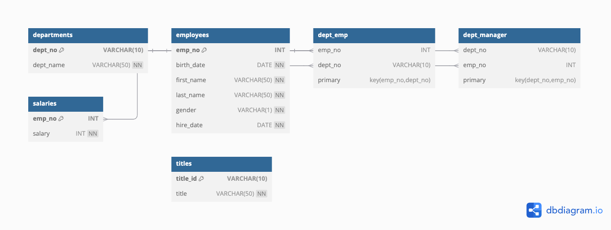

# SQL Employee Database Challenge 

##  Files in This Repository
- `ERD.png` - Entity Relationship Diagram of the database.
- `EmployeeSQL/employeeschemata.sql` - SQL schema for creating tables.
- `EmployeeSQL/official_employee_queries.sql` - SQL queries for analysis.
- `data/` - Contains CSV files for database population.

## Database Design
The database consists of:
- **employees**: Stores employee details.
- **departments**: Contains department names and IDs.
- **dept_emp**: Links employees to departments.
- **dept_manager**: Lists department managers.
- **salaries**: Stores employee salary information.
- **titles**: Holds job title records.

## SQL Queries
Some key queries include:
- Listing employee salaries
- Finding managers per department
- Identifying employees hired in 1986
- Counting the most common last names

## How to Use
1. **Create the database** in PostgreSQL.
2. **Run the SQL schema** (`employeeschemata.sql`) to create tables.
3. **Import CSV data** into respective tables.
4. **Run analysis queries** (`official_employee_queries.sql`).

## ERD Diagram
